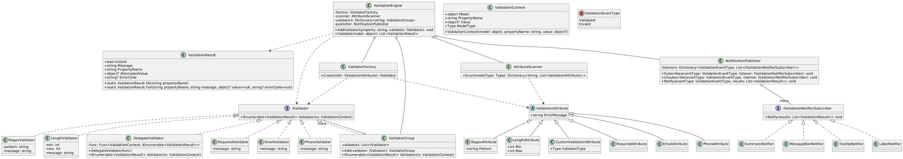
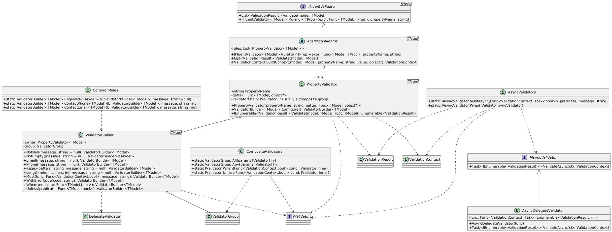

# Validation Framework - Báo cáo đồ án

## 1. Phân tích vấn đề

### Bài toán
- Dữ liệu nhập từ UI thường là chuỗi, cần kiểm tra hợp lệ trước khi lưu trữ hoặc xử lý.
- Các ràng buộc phổ biến: bắt buộc nhập, định dạng email, số điện thoại, độ dài, regex, ...
- Yêu cầu framework dễ dùng, dễ mở rộng, hỗ trợ custom rule, có thể tích hợp vào nhiều loại ứng dụng (WinForms, WinUI, Console, ...).

### Mục tiêu framework
- Đơn giản khi áp dụng vào ứng dụng thực tế.
- Hỗ trợ nhiều loại validation, dễ mở rộng/custom.
- Có thể dùng bằng code hoặc attribute.
- Hỗ trợ tổng hợp thông báo, nhiều cách hiển thị thông báo.

## 2. Giải pháp thiết kế


### Sơ đồ lớp tổng thể



**Sơ đồ lớp chain-base validation**



#### Các design pattern đã áp dụng
- **Strategy**: Định nghĩa interface `IValidator` cho các thuật toán kiểm tra dữ liệu. Mỗi loại kiểm tra (Required, Email, Regex, ...) là một strategy riêng biệt, có thể thay đổi hoặc mở rộng mà không ảnh hưởng đến hệ thống. Khi cần thêm loại kiểm tra mới, chỉ cần tạo một class mới kế thừa `IValidator`.
- **Composite**: Cho phép kết hợp nhiều validator cho một property thông qua `ValidatorGroup`. Nhóm các validator lại để kiểm tra một trường dữ liệu với nhiều điều kiện cùng lúc. Composite giúp quản lý tập hợp các rule một cách linh hoạt, có thể lồng ghép các nhóm kiểm tra.
- **Factory Method**: Sử dụng `ValidatorFactory` để tạo ra các validator từ các attribute khai báo trên model. Factory giúp tách biệt logic khởi tạo validator, dễ mở rộng khi có thêm loại attribute mới.
- **Facade**: Lớp `ValidationEngine` đóng vai trò facade, cung cấp API đơn giản cho việc validate model, ẩn đi các chi tiết phức tạp như quản lý validator, nhóm rule, thông báo kết quả. Người dùng chỉ cần gọi một vài phương thức để thực hiện toàn bộ quá trình kiểm tra dữ liệu.
- **Observer**: Hệ thống thông báo kết quả kiểm tra sử dụng `NotificationPublisher` và interface `IValidationNotifierSubscriber`. Các notifier (MessageBox, Tooltip, Label, Summary, ...) đăng ký nhận sự kiện và tự động cập nhật giao diện khi có kết quả validate. Observer giúp framework dễ dàng mở rộng cách hiển thị thông báo mà không ảnh hưởng đến core logic.
- **Builder Pattern**: Lớp `ValidatorBuilder<T>` đóng vai trò builder, cho phép người dùng khai báo từng rule cho mỗi property thông qua các lời gọi phương thức liên tiếp (method chaining). Quá trình này chỉ thực hiện xây dựng cấu hình validation, chưa thực thi kiểm tra dữ liệu. Việc validate chỉ được thực hiện sau khi cấu hình hoàn tất và gọi `Build() → Validate()`.

#### Mô tả các lớp chính
- `ValidationResult`: Kết quả kiểm tra (IsValid, Message, PropertyName)
- `IValidator`: Interface cho các validator
- `RequiredValidator`, `EmailValidator`, ...: Các validator cụ thể
- `ValidatorGroup`: Gom nhiều validator cho một property
- `ValidationAttribute`: Attribute cho khai báo ràng buộc
- `ValidatorFactory`: Tạo validator từ attribute
- `ValidationEngine`: Quản lý, thực thi validate cho model
- `NotificationPublisher`, `IValidationNotifierSubscriber`: Hỗ trợ thông báo tới UI
- `ValidatorBuilder`: Builder dùng để cấu hình validation bằng code theo dạng chain.
- `PropertyValidator`: Đại diện cho tập rule của một property cụ thể trong mô hình Chain-based. Mỗi property được ánh xạ tới một PropertyValidator, bên trong chứa ValidatorGroup tương ứng.
- `DelegateValidator`: Cho phép định nghĩa rule validation bằng lambda hoặc delegate, phục vụ các logic nghiệp vụ đặc thù mà các validator có sẵn không đáp ứng được.
- `AbstractValidator`: Lớp validator tổng hợp được tạo ra sau khi gọi `Build()`, sử dụng chung cơ chế validate của framework và đóng vai trò cầu nối giữa Chain-based API và core validation engine.


### Cải tiến nổi bật
## 3. Chain-based Validation API (phong cách chain, dễ dùng)

### 3.1. Mục tiêu thiết kế
Framework không hướng tới sao chép FluentValidation mà cung cấp một **Chain-based Validation API** với mục tiêu:
- Viết rule dễ đọc, gần với ngôn ngữ tự nhiên
- Tránh cấu hình rườm rà
- Không phụ thuộc vào attribute
- Phù hợp với cả bài toán học thuật và thực tế

Ví dụ mong muốn:
```csharp
Validator.For<UserModel>()
    .Property(x => x.Email)
        .Required()
        .Email()
        .WithMessage("Email không hợp lệ")
    .Property(x => x.Age)
        .GreaterThan(18)
    .Build();
```

### 3.2. Các thành phần chính của Chain-based API
| Thành phần | Vai trò |
|---|---|
| AbstractValidator<T> | Validator gốc, quản lý toàn bộ rule |
| PropertyValidator<T> | Đại diện rule cho một property |
| ValidatorBuilder<T> | Builder tạo và chain các rule |
| IValidator | Strategy kiểm tra dữ liệu |
| ValidatorGroup | Composite gom nhiều validator |
| DelegateValidator | Custom rule bằng lambda |

### 3.3. Luồng hoạt động
- Người dùng khởi tạo ValidatorBuilder<T>
- Mỗi Property(...) tạo ra một PropertyValidator
- Các rule được add vào ValidatorGroup
- Khi Build(): Toàn bộ rule được đóng gói vào AbstractValidator<T>
- Khi gọi Validate(model): Tạo ValidationContext, thực thi từng validator, tổng hợp ValidationResult

### 3.4. Design Pattern trong Chain-based API
- **Builder Pattern**: Xây dựng cấu hình rule theo từng bước
- **Method Chaining**: Tăng khả năng đọc và viết code
- **Strategy Pattern**: Mỗi rule là một chiến lược độc lập
- **Composite Pattern**: Kết hợp nhiều rule cho một property

## 3. Hướng dẫn sử dụng framework

### 3.1. Sử dụng Attribute (Metadata)
```csharp
public class UserModel {
    [Required(ErrorMessage = "Bắt buộc nhập")]
    [Email(ErrorMessage = "Email không hợp lệ")]
    public string Email { get; set; }
}

var engine = new ValidationEngine();
var results = engine.Validate(userModel);
```

### 3.2. Sử dụng Chain-base API
```csharp
var validator = ValidatorBuilder<UserModel>
    .For(x => x.Email).Required().Email().WithMessage("Email không hợp lệ")
    .For(x => x.Phone).Required().Phone()
    .Build();

var result = validator.Validate(user);
```

### 3.3. Custom Validator
```csharp
public class AdultValidator : IValidator {
    public ValidationResult Validate(object value, string propertyName) {
        int age = (int)value;
        return age >= 18
            ? ValidationResult.Valid()
            : ValidationResult.Invalid(propertyName, "Tuổi phải >= 18");
    }
}

// Đăng ký vào validation API
var validator = ValidatorBuilder<UserModel>
    .For(x => x.Age).Custom(new AdultValidator())
    .Build();
```

### 3.4. Thông báo kết quả
- Có thể đăng ký nhiều notifier (MessageBox, Tooltip, Label, Summary, ...)
- Ví dụ:
```csharp
var publisher = new NotificationPublisher();
publisher.Subscribe(ValidationEventType.Summary, new SummaryNotifier());
engine.SetNotifier(publisher);
```

## 4. Danh sách tính năng
| Tính năng | Mức độ hoàn thành |
|-----------|-------------------|
| Validate bằng attribute | Đã xong |
| Validate bằng Fluent API | Đã xong |
| Custom validator | Đã xong |
| Kết hợp nhiều rule | Đã xong |
| Hỗ trợ regex | Đã xong |
| Thông báo đa dạng | Đã xong |
| Demo | Đã xong |

## 5. Hướng dẫn tích hợp vào project khác
- Thêm reference tới project (hoặc DLL) ValidationFramework.
- Khai báo model và rule (bằng attribute hoặc Fluent API).
- Gọi ValidationEngine để kiểm tra dữ liệu.
- Đăng ký notifier nếu muốn hiển thị thông báo tự động.

## 6. Tài liệu khác
- Xem thêm ví dụ trong thư mục Demo, Demo.Winforms, Demo.WinUI.
- Xem file `FrameworkFeatures.md` để biết chi tiết các tính năng.
